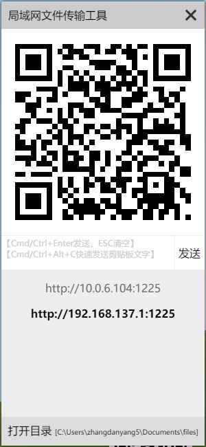
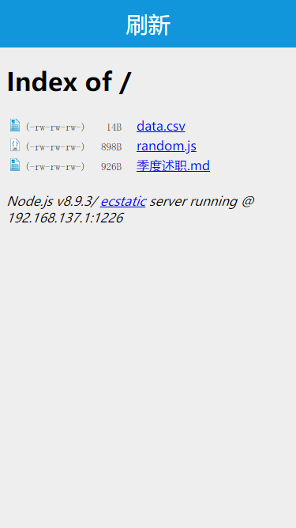
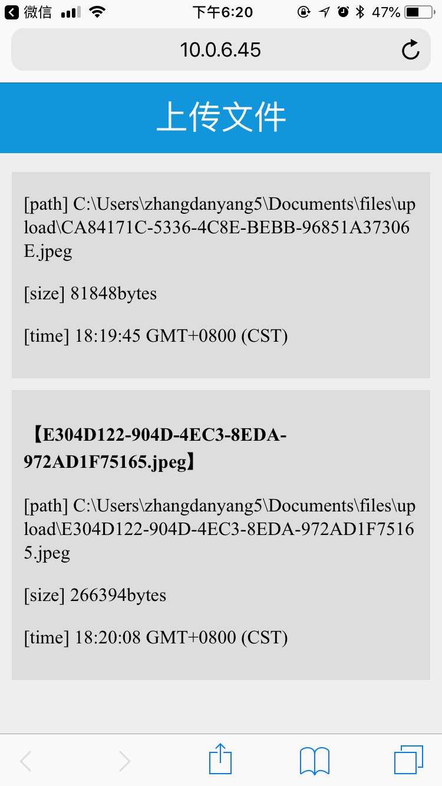
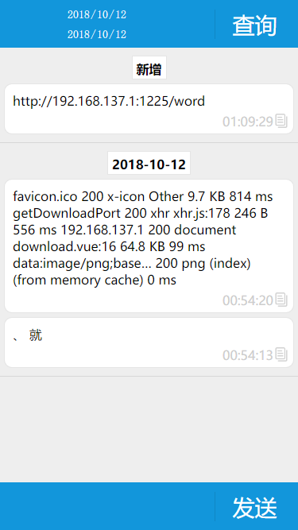

# 局域网共享工具


[下载地址](https://github.com/sirzdy/share/releases)


**局域网内设备通过wifi实现文件传输(电脑<->移动设备)**

**局域网内设备通过wifi实现文本传输(电脑<->移动设备)**

## 功能

- 下载文件：移动设备访问电脑磁盘文件并下载
- 上传文件：移动设备上传文件到电脑
- 文本传输：实现电脑设备与移动设备的文本快速共享


## 安装与使用

### 安装

#### Windows

下载 exe 文件执行即可，默认安装到 `~/AppData/Local/Programs` 目录下，安装目录不可更改。

#### Mac 

下载 dmg 文件打开后，将 app 拖拽到应用程序目录。

### 卸载

#### Windows

使用 `控制面板-程序-程序和功能-卸载或更改程序` 进行卸载。
（Win10以上可以使用 `设置-应用和功能` 进行卸载

#### Mac 

将应用程序目录下的app移动到废纸篓。


### 使用

- 使用前请确保电脑与移动设备处于同一局域网，包括同一路由器下的不同设备或者设备共享热点的方式(windows可以通过win10自带移动热点或猎豹wifi等共享热点)，mac通过共享功能开启热点。)。
- 在电脑上打开应用服务端。应用将启动服务，生成导航链接，并生成当前高亮链接的二维码。链接会生成多个，请自行选择跟移动设备对应的链接。- 左键点击链接可以生成对应的二维码，右键点击链接在默认浏览器中打开当前链接。
- 点击打开目录预览共享目录，可以通过资源管理器向共享目录拷贝文件目录等，亦可以将文件拖拽带应用窗口实现文件上传(不支持文件夹)。
- 移动设备浏览器中打开对应链接。扫描二维码(iphone自带相机即可扫描二维码)/手动输入地址
- 使用 `Cmd/Ctrl+Alt+C` 可以快速发送剪贴板文字，也可以使用面本的文本框输入并发送(输入框支持Cmd/Ctrl+Enter发送，ESC清空)，也可以使用托盘菜单快速发送剪贴板文字。
- 默认共享目录是 `~/Documents/files/`，托盘菜单选择设置目录可以修改目录。
- 下载目录新增文件、新增文本传输可以实时通知。
- 注意：本文档可能更新不及时，具体功能请以实际为主。

## 快照

### 服务端

【应用快照】



### 客户端

【首页快照】


【下载快照】



【上传快照】



【文本传输快照】




## 运行

```bash
# Clone this repository
git clone https://github.com/sirzdy/file-transfer.git
# Go into the repository
cd file-transfer
# Install dependencies
npm install electron-builder -g
npm install
# Run the app
npm start
# Pack 
npm run dist
```

[客户端源码-Github](https://github.com/sirzdy/share)

## 技术点

- 使用 [electron](https://github.com/electron/electron) 构建应用
- 使用 [electron-settings](https://github.com/nathanbuchar/electron-settings) 存储用户配置
- 使用 [http-server](https://github.com/indexzero/http-server) 实现下载服务
- 使用 [express](https://github.com/expressjs/express) [multer](https://github.com/expressjs/multer) 实现上传服务
- 使用 [QRCode.js](https://github.com/davidshimjs/qrcodejs) 实现二维码生成
- 使用 [socket.io](https://socket.io/) 实现文本传输
- 使用 [fast-csv](https://github.com/C2FO/fast-csv) 实现文本存储到csv文件

## License

<a rel="license" href="http://creativecommons.org/licenses/by-nc-sa/4.0/"></a><br />This work is licensed under a <a rel="license" href="http://creativecommons.org/licenses/by-nc-sa/4.0/">Creative Commons Attribution-NonCommercial-ShareAlike 4.0 International License</a>.
